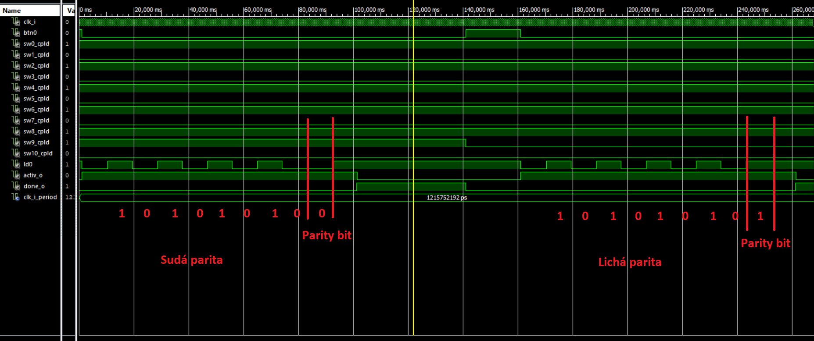
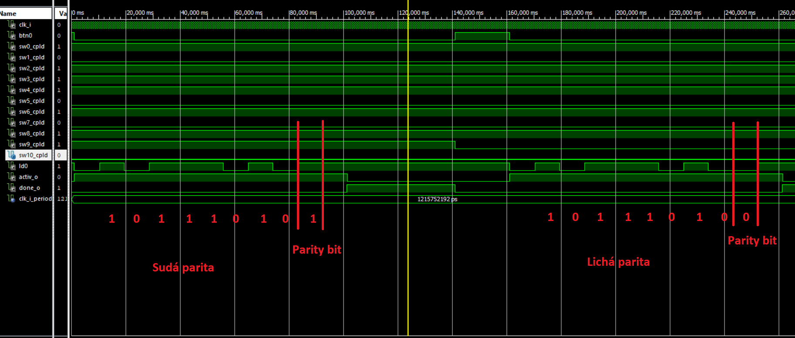
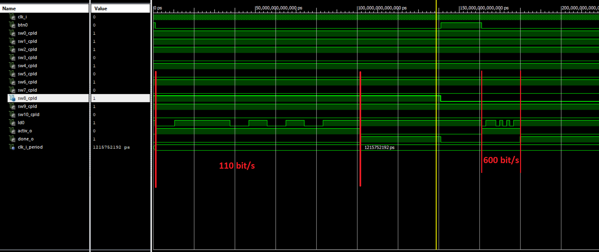
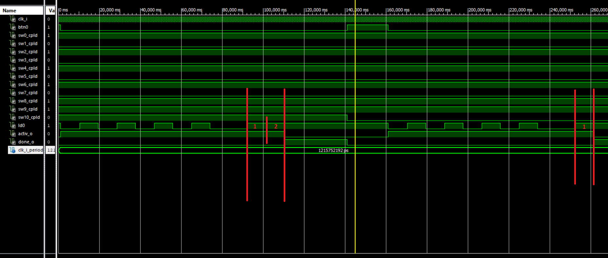

## Parita sudá/lichá
&nbsp;
* Na nasledujúcich obrázkoch je vidieť meniaci sa parity bit pri prechode zo sudej parity na lichú pri rôznych počtoch jednotiek.
&nbsp;

&nbsp;

## Rýchlosť
&nbsp;
* Rýchlosť je možné voliť medzi hodnotami 110 bit/s a 600 bit/s, ako je aj vidieť.
&nbsp;

## Dvojitý stop bit
&nbsp;
* Pridali sme možnosť zvoliť si medzi jedným alebo dvoma stop bitmi, s ktorou sme sa stretli pri študovaní problematiky.
Určiť počet stop bitov môžeme pri porovnaní signálu s hladinou active.
&nbsp;

&nbsp;
## Zdroje:
* <https://en.wikipedia.org/wiki/Universal_asynchronous_receiver-transmitter>

* <https://www.nandland.com/vhdl/modules/module-uart-serial-port-rs232.html>

* <https://electronics.stackexchange.com/questions/9264/what-standard-uart-rates-are-there>
